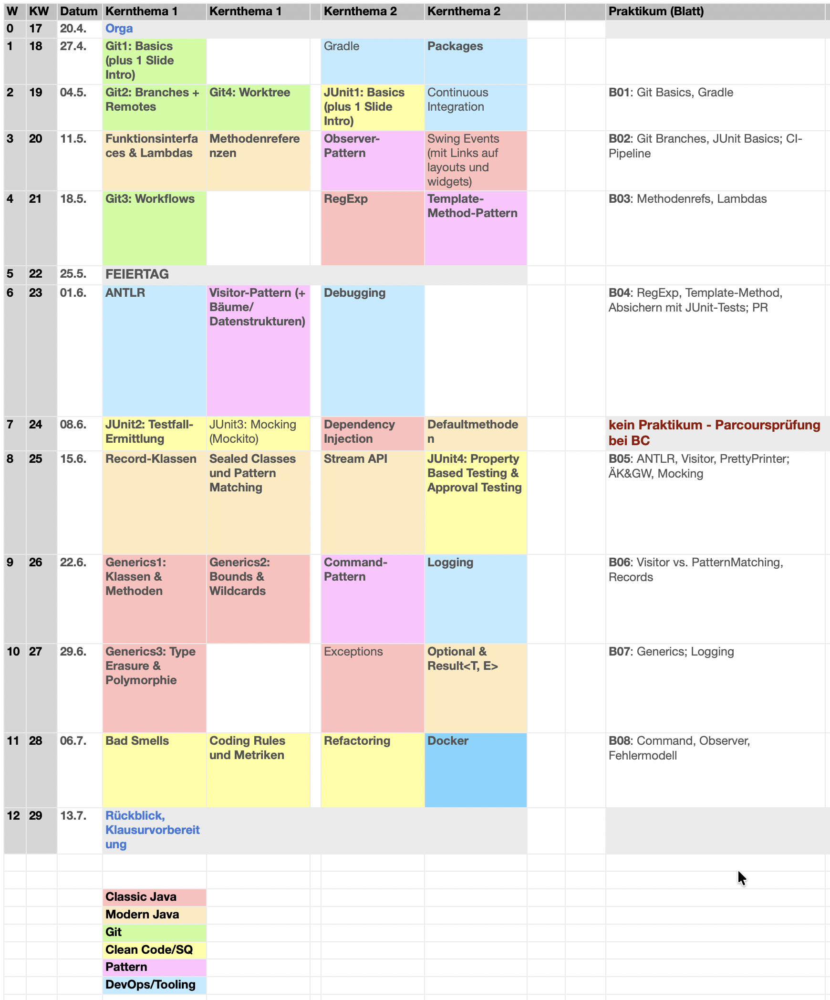

<!--  pandoc -s -f markdown -t markdown+smart-grid_tables-multiline_tables-simple_tables --columns=94 --reference-links=true  readme.md  -o xxx.md  -->

---

> ... And, lastly, there's the explosive growth in demand, which has led to many people doing
> it who aren't any good at it. Code is merely a means to an end.
> **Programming is an art and code is merely its medium.**
> Pointing a camera at a subject does not make one a proper photographer. There are a lot of
> self-described coders out there who couldn't program their way out of a paper bag.
>
> \hfill -- John Gruber auf [daringfireball.net]

  [daringfireball.net]: https://daringfireball.net/2020/04/cobol_programming_coding

::: tip
**Vorschau**

Sie können die Vorlesungsunterlagen in zwei Varianten anschauen:

*   [Markdown in GitHub](https://github.com/Programmiermethoden-CampusMinden/Prog2-Lecture/blob/_gfm/readme.md)
*   [Docsify (experimentell)](https://docsify-this.net/?basePath=https://raw.githubusercontent.com/Programmiermethoden-CampusMinden/Prog2-Lecture/refs/heads/_docsify&homepage=readme.md&sidebar=true&browser-tab-title=PR2&font-size=14px&searchbox=true&externalLinkTarget=_blank&mergeNavbar=true&zoom-images=true&dark-mode=auto#/)
:::

# Kursbeschreibung

Sie haben letztes Semester in **Prog1** die *wichtigsten* Elemente und Konzepte der
Programmiersprache Java kennen gelernt.

In diesem Modul geht es darum, diese Kenntnisse sowohl auf der Java- als auch auf der
Methoden-Seite so zu erweitern, dass Sie gemeinsam größere Anwendungen erstellen und pflegen
können. Sie werden fortgeschrittene Konzepte in Java kennenlernen und sich mit etablierten
Methoden in der Softwareentwicklung wie Versionierung von Code, Einhaltung von Coding
Conventions, Grundlagen des Softwaretests, Anwendung von Refactoring, Einsatz von Build-Tools
und Logging auseinander setzen. Wenn uns dabei ein Entwurfsmuster "über den Weg läuft", werden
wir die Gelegenheit nutzen und uns dieses genauer anschauen.

# Überblick Modulinhalte

1.  Fortgeschrittene Konzepte in Java ("Classic Java")
    - Reguläre Ausdrücke, Annotationen, Reflection
    - Generische Programmierung: Generics
    - Parallele Programmierung: Threads
    - ~~CLI~~, ~~Konfiguration~~, fremde APIs nutzen[^1]
    - Graphische Oberflächen mit Swing[^2]
2.  Fortgeschrittene Konzepte in Java ("FP")
    - Default-Methoden, Funktionsinterfaces, Methodenreferenzen, Lambdas, Optional, Stream-API
3.  Versionierung mit Git
4.  Softwarequalität
    - Testen, Coding Conventions & Smells, Refactoring, Javadoc, Logging
5.  Entwurfsmuster
    - ~~Strategy~~, Template-Method, ~~Factory-Method~~, ~~Singleton~~, Observer, Visitor,
      Command, ...
6.  Bauen von Software
    - Gradle, Docker, Continuous Integration (GitHub Workflows)

(_durchgestrichene Themen nicht im Sommersemester 2025_)

[^1]: als Teilaufgabe im Praktikum

[^2]: nur als Wiederholung im Praktikum

# Team

- [Carsten Gips] (Sprechstunde nach Vereinbarung)
- [BC George] (Sprechstunde nach Vereinbarung)
- Tutoren (siehe ILIAS-Mitgliederliste)

  [Carsten Gips]: https://www.hsbi.de/minden/ueber-uns/personenverzeichnis/carsten-gips
  [BC George]: https://www.hsbi.de/minden/ueber-uns/personenverzeichnis/birgit-christina-george

# Kursformat

{width="80%"}

| Vorlesung (2 SWS)              | Praktikum (2 SWS)                           |
|:-------------------------------|:--------------------------------------------|
| Fr, 08:00 - 09:30 Uhr (online) | G1: Fr, 09:45 - 11:15 Uhr (online, Carsten) |
| (Carsten: *Flipped Classroom*) | G2: Fr, 11:30 - 13:00 Uhr (online, Carsten) |
|                                | G3: Fr, 09:45 - 11:15 Uhr (online, BC)      |
|                                | G4: Fr, 11:30 - 13:00 Uhr (online, BC)      |

Online-Sitzungen per Zoom (**Zugangsdaten siehe [ILIAS]**).
Sie *können* hierzu den Raum J101 bzw. J104 (vgl. Stundenplan) nutzen.

  [ILIAS]: https://www.hsbi.de/elearning/goto.php?target=crs_1486054&client_id=FH-Bielefeld

# Fahrplan

Hier finden Sie einen abonnierbaren [Google Kalender] mit allen Terminen der Veranstaltung zum Einbinden in Ihre Kalender-App.

| Monat              | Tag       | Vorlesung                                                                                              | VL-Quiz      | Praktikum    |
|:-------------------|:----------|:-------------------------------------------------------------------------------------------------------|:-------------|:-------------|
| April              | 11.       | Orga (**Zoom**), [FAQ]                                                                                 |              |              |
|                    | 18.       | **Feiertag**                                                                                           | **Feiertag** | **Feiertag** |
|                    | 25.       | [Einführung Versionierung], [Git Basics]; [Lambda-Ausdrücke]; [Gradle]                                 | [Q01]        | [B01]        |
| Mai                | 02.       | [Git-Branches], [Branching-Strategien]; [Methodenreferenzen]; [Logging]                                | [Q02]        | [B02]        |
|                    | 09.       | [Git-Remotes], [Git-Workflows]; [Stream-API]; [Record-Klassen]                                         | [Q03]        | [B03]        |
|                    | 16.       | **Station I** 09-11 Uhr, B40 (Aufteilung siehe [Ankündigung #997])                                     |              |              |
|                    | 23.       | [Einführung Testen], [JUnit-Basics]; [Optional]; [Visitor-Pattern]                                     | [Q04]        | [B04]        |
|                    | 30.       | [Testfallermittlung], [Mocking]; [Default-Methoden]; [Observer-Pattern]; [Continuous Integration (CI)] | [Q05]        | [B05]        |
| Juni               | 06.       | [Code-Smells], [Coding-Rules], [Refactoring]; [Javadoc]                                                | [Q06]        | [B06]        |
|                    | 13.       | **Station II** 09:00-10:30 Uhr, B40 (Aufteilung siehe [Ankündigung #1025])                             |              |              |
|                    | 20.       | [RegExp]; [Template-Method-Pattern], [Command-Pattern]; [Annotationen]                                 | [Q07]        | [B07]        |
|                    | 27.       | Generics: [Klassen und Methoden], [Bounds und Wildcards], [Type Erasure], [Polymorphie]; [Docker]      | [Q08]        | [B08]        |
| Juli               | 04.       | [Intro Threads], [Synchronisierung], [Highlevel Threadkonzepte]; [Reflection]                          | [Q09]        | [B09]        |
| *Prüfungsphase I*  | 09.07.    | **Station III**, B40 (Aufteilung siehe Ankündigung)                                                    |              |              |
| *Prüfungsphase II* | 24.09.(?) | **Station IV**, B40 (Aufteilung siehe Ankündigung)                                                     |              |              |

Abgabe der Übungsblätter jeweils **bis Fr, 08:00 Uhr** [im ILIAS](https://www.hsbi.de/elearning/goto.php?target=exc_1514856&client_id=FH-Bielefeld), Vorstellung der
Lösung im zugehörigen Praktikum.
Bearbeitung der Quizzes jeweils **Sa, 00:00 Uhr (Vorwoche) bis Fr, 08:00 Uhr** [im ILIAS](https://www.hsbi.de/elearning/goto.php?target=fold_1514843&client_id=FH-Bielefeld).

[Google Kalender]: https://calendar.google.com/calendar/ical/69ecbae80c817d60571a6ec968890b9b7ef0ffea5ce5dad1ef06c46eef7c530f%40group.calendar.google.com/public/basic.ics

[Prüfungsvorbereitung]: admin/exams.md
[FAQ]: https://github.com/Programmiermethoden-CampusMinden/Prog2-Lecture/discussions/categories/q-a
[Ankündigung #997]: https://github.com/Programmiermethoden-CampusMinden/Prog2-Lecture/discussions/997
[Ankündigung #1025]: https://github.com/Programmiermethoden-CampusMinden/Prog2-Lecture/discussions/1025

[Gradle]: lecture/building/gradle.md
<!-- [ANT]: lecture/building/ant.md -->
<!-- [Maven]: lecture/building/maven.md -->
[Continuous Integration (CI)]: lecture/building/ci.md
[Docker]: lecture/building/docker.md

[Einführung Versionierung]: lecture/git/git-intro.md
[Git Basics]: lecture/git/git-basics.md
[Git-Branches]: lecture/git/branches.md
[Branching-Strategien]: lecture/git/branching-strategies.md
[Git-Remotes]: lecture/git/remotes.md
[Git-Workflows]: lecture/git/workflows.md
<!-- [Git-Worktree]: lecture/git/worktree.md -->
<!-- [Git-Bisect]: lecture/git/bisect.md -->

<!-- [Swing Basics]: lecture/gui/swing-basics.md -->
<!-- [Swing Widgets]: lecture/gui/widgets.md -->
<!-- [Layout Manager]: lecture/gui/layouts.md -->
<!-- [Swing Events]: lecture/gui/events.md -->
<!-- [Swing: Tabellen]: lecture/gui/tables.md -->
<!-- [Java2D]: lecture/gui/java2d.md -->

[Logging]: lecture/quality/logging.md
[Klassen und Methoden]: lecture/java-classic/generics-classes-methods.md
[Bounds und Wildcards]: lecture/java-classic/generics-bounds-wildcards.md
[Type Erasure]: lecture/java-classic/generics-type-erasure.md
[Polymorphie]: lecture/java-classic/generics-polymorphism.md
<!-- [Serialisierung]: lecture/java-classic/serialisation.md -->
<!-- [Collections]: lecture/java-classic/collections.md -->
[RegExp]: lecture/java-classic/regexp.md
[Annotationen]: lecture/java-classic/annotations.md
[Reflection]: lecture/java-classic/reflection.md
<!-- [Exception-Handling]: lecture/java-classic/exceptions.md -->
<!-- [Enumerationen]: lecture/java-classic/enums.md -->
<!-- [Konfiguration]: lecture/java-classic/configuration.md -->
[Intro Threads]: lecture/java-classic/threads-intro.md
[Synchronisierung]: lecture/java-classic/threads-synchronisation.md
[Highlevel Threadkonzepte]: lecture/java-classic/threads-highlevel.md

[Lambda-Ausdrücke]: lecture/java-modern/lambdas.md
[Methodenreferenzen]: lecture/java-modern/methodreferences.md
[Stream-API]: lecture/java-modern/stream-api.md
[Optional]: lecture/java-modern/optional.md
[Record-Klassen]: lecture/java-modern/records.md
[Default-Methoden]: lecture/java-modern/defaultmethods.md

<!-- [Intro Frameworks]: lecture/misc/intro-frameworks.md -->
<!-- [Intro Dungeon]: lecture/misc/dungeon.md -->

<!-- [Strategy-Pattern]: lecture/pattern/strategy.md -->
[Visitor-Pattern]: lecture/pattern/visitor.md
[Observer-Pattern]: lecture/pattern/observer.md
[Command-Pattern]: lecture/pattern/command.md
<!-- [Singleton-Pattern]: lecture/pattern/singleton.md -->
[Template-Method-Pattern]: lecture/pattern/template-method.md
<!-- [Factory-Method-Pattern]: lecture/pattern/factory-method.md -->
<!-- [Type-Object-Pattern]: lecture/pattern/type-object.md -->
<!-- [Flyweight-Pattern]: lecture/pattern/flyweight.md -->

[Javadoc]: lecture/quality/javadoc.md
[Code-Smells]: lecture/quality/smells.md
[Coding-Rules]: lecture/quality/codingrules.md
[Refactoring]: lecture/quality/refactoring.md
[Einführung Testen]: lecture/quality/testing-intro.md
[JUnit-Basics]: lecture/quality/junit-basics.md
[Testfallermittlung]: lecture/quality/testcases.md
[Mocking]: lecture/quality/mockito.md

[B01]: homework/b01.md
[B02]: homework/b02.md
[B03]: homework/b03.md
[B04]: homework/b04.md
[B05]: homework/b05.md
[B06]: homework/b06.md
[B07]: homework/b07.md
[B08]: homework/b08.md
[B09]: homework/b09.md

[Q01]: https://www.hsbi.de/elearning/goto.php?target=tst_1527333&client_id=FH-Bielefeld
[Q02]: https://www.hsbi.de/elearning/goto.php?target=tst_1527338&client_id=FH-Bielefeld
[Q03]: https://www.hsbi.de/elearning/goto.php?target=tst_1527339&client_id=FH-Bielefeld
[Q04]: https://www.hsbi.de/elearning/goto.php?target=tst_1527340&client_id=FH-Bielefeld
[Q05]: https://www.hsbi.de/elearning/goto.php?target=tst_1527341&client_id=FH-Bielefeld
[Q06]: https://www.hsbi.de/elearning/goto.php?target=tst_1527342&client_id=FH-Bielefeld
[Q07]: https://www.hsbi.de/elearning/goto.php?target=tst_1527343&client_id=FH-Bielefeld
[Q08]: https://www.hsbi.de/elearning/goto.php?target=tst_1527344&client_id=FH-Bielefeld
[Q09]: https://www.hsbi.de/elearning/goto.php?target=tst_1527345&client_id=FH-Bielefeld

# Prüfungsform, Note und Credits

**Parcoursprüfung**, 5 ECTS (PO23)

Da Sie das Programmierhandwerk erlernen und üben und vertiefen sollen, dürfen Sie im Rahmen
dieser Lehrveranstaltung noch keine KI-gestützten Assistenten benutzen. Lösungen, die dennoch
ganz oder teilweise unter Zuhilfenahme von KI-Unterstützung erstellt wurden, werden wie nicht
abgegeben behandelt.

## Prüfung im ersten Zeitraum

1.  **Quizzes**: mind. 5 der 9 Quizzes bestanden (ohne Note/Punkte)
    (Einzelbearbeitung, fristgerecht bis zur jeweiligen Vorlesung, je Quiz
    bis zu 3x wiederholbar)
2.  **Praktikum**: mind. 5 der 9 Übungsblätter bestanden (ohne Note/Punkte)
    (bis zu 3er Teams, alle Aufgaben eines Blattes bearbeitet, individuelle(!)
    fristgerechte Abgabe der Lösungen im ILIAS als aussagekräftiges
    [*Post Mortem*](https://github.com/Programmiermethoden-CampusMinden/Prog2-Lecture/discussions/981)[^postmortem],
    Vorstellung der Lösungen im Praktikum durch jedes Teammitglied, aktive
    Beteiligung an der Diskussion im Praktikum)
3.  **Station I**: ILIAS-Test (30 Minuten in Minden im B40)
4.  **Station II**: ILIAS-Test (30 Minuten in Minden im B40)
5.  **Station III**: ILIAS-Test (30 Minuten in Minden im B40)

[^postmortem]: **Post Mortem**: Jede Person beschreibt in der ILIAS-Abgabe individuell(!) die
    Bearbeitung des jeweiligen Aufgabenblattes zurückblickend mit 200 bis 400 Wörtern. Gehen
    Sie dabei aussagekräftig und nachvollziehbar auf folgende Punkte ein: (a) Zusammenfassung:
    Was wurde gemacht? (b) Implementierungsdetails: Kurze Beschreibung besonders interessanter
    Aspekte der Umsetzung. (c) Was war der schwierigste Teil bei der Bearbeitung? Wie haben Sie
    dieses Problem gelöst? (d) Was haben Sie gelernt oder (besser) verstanden? (e) Team: Mit wem
    haben Sie zusammengearbeitet? (f) Links zu Ihren Pull-Requests mit der Lösung (erst ab Blatt 04).
    Siehe auch https://github.com/Programmiermethoden-CampusMinden/Prog2-Lecture/discussions/981.

Station I und II finden im Vorlesungsslot statt ([Aufteilung siehe separate Ankündigung](https://github.com/Programmiermethoden-CampusMinden/Prog2-Lecture/discussions/1025)),
Station III im ersten Prüfungszeitraum (Termin lt. Bekanntgabe vom Prüfungsamt: 09.07.).
Die Punkte der beiden besseren Stationen werden summiert für die Berechnung der Note.

**Gesamtnote**: 4.0: ab 50%, alle 5% nächste Teilnote, 1.0: ab 95% (jeweils nur wenn Quizzes
bestanden und Praktikum bestanden)

Bei mind. drei über das Minimum hinaus bestandenen Quizzes und/oder Aufgabenblättern
verbessert sich die Gesamtnote um eine Teilnote.

(Hinweise zur [Prüfungsvorbereitung] für Station I bis III)

## Prüfung im zweiten Zeitraum

1.  **Station IV**: Schriftliche Prüfung (digitale Klausur) 90 Minuten in Minden im B40
    (Termin lt. Bekanntgabe vom Prüfungsamt: voraussichtlich 24.09.)

**Gesamtnote**: 4.0: ab 50%, alle 5% nächste Teilnote, 1.0: ab 95%

(Hinweise zur [Prüfungsvorbereitung] für Station IV)

# Materialien

## Literatur

1.  ["**Java ist auch eine Insel**"]. Ullenboom, C., Rheinwerk-Verlag, 2021. ISBN
    [978-3-8362-8745-6].
2.  ["**Pro Git** (Second Edition)"]. Chacon, S. und Straub, B., Apress, 2014. ISBN
    [978-1-4842-0077-3].
3.  ["The Java Tutorials"]. Oracle Corporation, 2024.
4.  ["Learn Java"]. Oracle Corporation, 2025.

  ["**Java ist auch eine Insel**"]: https://openbook.rheinwerk-verlag.de/javainsel/index.html
  [978-3-8362-8745-6]: https://fhb-bielefeld.digibib.net/openurl?isbn=978-3-8362-8745-6
  ["**Pro Git** (Second Edition)"]: https://git-scm.com/book/en/v2
  [978-1-4842-0077-3]: https://fhb-bielefeld.digibib.net/openurl?isbn=978-1-4842-0077-3
  ["The Java Tutorials"]: https://docs.oracle.com/javase/tutorial/
  ["Learn Java"]: https://dev.java/learn/

## Tools

- JDK: **Java SE 21 (LTS)** ([Oracle] oder [Alternativen], bitte 64-bit Version nutzen)
- IDE: [Eclipse IDE for Java Developers] oder [IntelliJ IDEA (Community Edition)] oder [Visual
  Studio Code] oder [Vim] oder ...
- [Git]

  [Oracle]: https://www.oracle.com/java/technologies/downloads/
  [Alternativen]: https://code.visualstudio.com/docs/languages/java#_install-a-java-development-kit-jdk
  [Eclipse IDE for Java Developers]: https://www.eclipse.org/downloads/
  [IntelliJ IDEA (Community Edition)]: https://www.jetbrains.com/idea/
  [Visual Studio Code]: https://code.visualstudio.com/
  [Vim]: https://www.vim.org/
  [Git]: https://git-scm.com/

# Förderungen und Kooperationen

## Förderung durch DH.NRW (Digi Fellowships)

Die Überarbeitung dieser Lehrveranstaltung wurde vom Ministerium für Kultur und Wissenschaft
(MKW) in NRW im Einvernehmen mit der Digitalen Hochschule NRW (DH.NRW) gefördert:
["Fellowships für Innovationen in der digitalen Hochschulbildung"] (*Digi Fellowships*).

["Fellowships für Innovationen in der digitalen Hochschulbildung"]: https://www.dh.nrw/kooperationen/Digi-Fellows-2

## Kooperation mit dem DigikoS-Projekt

Diese Vorlesung wurde vom Projekt ["Digitalbaukasten für kompetenzorientiertes Selbststudium"]
(*DigikoS*) unterstützt. Ein vom DigikoS-Projekt ausgebildeter Digital Learning Scout hat
insbesondere die Koordination der digitalen Gruppenarbeiten, des Peer-Feedbacks und der
Postersessions in ILIAS technisch und inhaltlich begleitet. DigikoS wird als Verbundprojekt
von der Stiftung Innovation in der Hochschullehre gefördert.

["Digitalbaukasten für kompetenzorientiertes Selbststudium"]: https://www.digikos.de

---

# LICENSE

[``{=markdown}](https://creativecommons.org/licenses/by-sa/4.0/)

Unless otherwise noted, [this work](https://github.com/Programmiermethoden-CampusMinden/Prog2-Lecture) by
[Carsten Gips](https://github.com/cagix) and [contributors](https://github.com/Programmiermethoden-CampusMinden/Prog2-Lecture/graphs/contributors)
is licensed under [CC BY-SA 4.0](https://github.com/Programmiermethoden-CampusMinden/Prog2-Lecture/blob/master/LICENSE.md).
See the [credits](CREDITS.md) for a detailed list of contributing projects.
