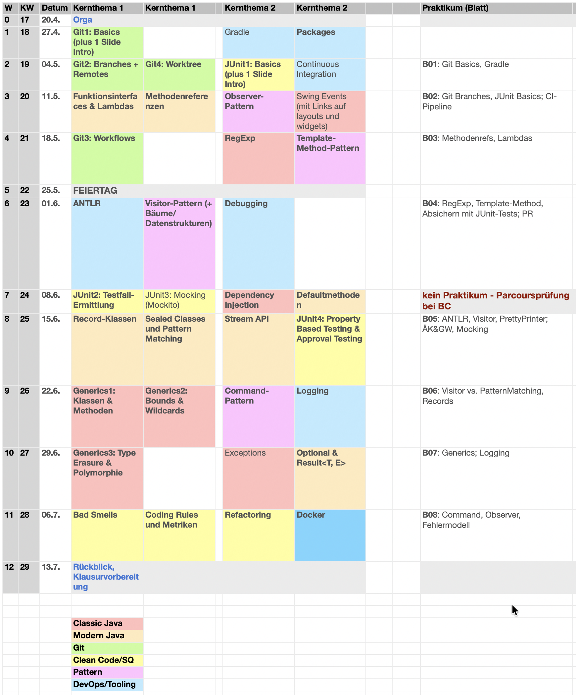

# Syllabus

> ... And, lastly, there's the explosive growth in demand, which has led to many
> people doing it who aren't any good at it. Code is merely a means to an end.
> **Programming is an art and code is merely its medium.** Pointing a camera at a
> subject does not make one a proper photographer. There are a lot of self-described
> coders out there who couldn't program their way out of a paper bag.
>
> `\hfill`{=tex} -- John Gruber auf
> [daringfireball.net](https://daringfireball.net/2020/04/cobol_programming_coding)

## Kursbeschreibung

Sie haben letztes Semester in **Prog1** die *wichtigsten* Elemente und Konzepte der
Programmiersprache Java kennen gelernt.

In diesem Modul geht es darum, diese Kenntnisse sowohl auf der Java- als auch auf
der Methoden-Seite so zu erweitern, dass Sie gemeinsam größere Anwendungen erstellen
und pflegen können. Sie werden fortgeschrittene Konzepte in Java kennenlernen und
sich mit etablierten Methoden in der Softwareentwicklung wie Versionierung von Code,
Einhaltung von Coding Conventions, Grundlagen des Softwaretests, Anwendung von
Refactoring, Einsatz von Build-Tools und Logging auseinander setzen. Wenn uns dabei
ein Entwurfsmuster "über den Weg läuft", werden wir die Gelegenheit nutzen und uns
dieses genauer anschauen.

## Überblick Modulinhalte

1.  Fortgeschrittene Konzepte in Java ("Classic Java")
    -   Reguläre Ausdrücke, Generics, Depencendy Injection
    -   Fremde APIs nutzen: ANTLR
    -   Graphische Oberflächen mit Swing
    -   Fehlerbehandlungskonzepte
2.  Fortgeschrittene Konzepte in Java ("FP")
    -   Default-Methoden, Funktionsinterfaces, Methodenreferenzen, Lambdas,
        Optional, Stream-API
    -   Records, Sealed Classes, Pattern Matching
3.  Versionierung mit Git
4.  Softwarequalität
    -   Testen mit JUnit und Mockito
    -   Coding Conventions & Smells, Refactoring
5.  Entwurfsmuster
    -   Observer, Visitor, Template-Method, Command
6.  Tooling und Bauen von Software
    -   Packages
    -   Logging, Debugging
    -   Gradle, Docker, Continuous Integration (GitHub Workflows)

## Team

-   [Carsten
    Gips](https://www.hsbi.de/minden/ueber-uns/personenverzeichnis/carsten-gips)
    (Sprechstunde nach Vereinbarung)
-   Alesia Herbertz (Tutorin)

## Kursformat

{width="80%"}

| Vorlesung (2 SWS)     | Praktikum (2 SWS)         |
|:----------------------|:--------------------------|
| Mo, 08:00 - 09:30 Uhr | G1: Mo, 11:30 - 13:00 Uhr |
| (*Flipped Classroom*) | G2: Mo, 14:00 - 15:30 Uhr |
|                       | G3: Mo, 09:45 - 11:15 Uhr |
|                       | G4: Mi, 08:00 - 09:30 Uhr |

Alle Sitzungen online per Zoom (**Zugangsdaten siehe
[ILIAS](https://www.hsbi.de/elearning/goto.php/crs/1634793)**).

## Fahrplan

Hier finden Sie einen abonnierbaren [Google
Kalender](https://calendar.google.com/calendar/ical/69ecbae80c817d60571a6ec968890b9b7ef0ffea5ce5dad1ef06c46eef7c530f%40group.calendar.google.com/public/basic.ics)
mit allen Terminen der Veranstaltung zum Einbinden in Ihre Kalender-App.

Abgabe der Post Mortems jeweils **Montag bis 09:00 Uhr** im
[ILIAS](https://www.hsbi.de/elearning/goto.php/exc/1664006). Vorstellung der Lösung
im jeweiligen Praktikum in der Abgabewoche.

| Monat | Tag  | Vorlesung (Mo)                                                                                                                                                                                                                                      | Praktikum (Mo/Mi)                       |
|:------|:-----|:----------------------------------------------------------------------------------------------------------------------------------------------------------------------------------------------------------------------------------------------------|:----------------------------------------|
| April | 20\. | [Orga](readme.md)                                                                                                                                                                                                                                   |                                         |
|       | 27\. | [Git1: Basics](lecture/git/git1-basics.md); [Gradle](lecture/tooling/gradle.md), [Packages](lecture/tooling/packages.md)                                                                                                                            |                                         |
| Mai   | 04\. | [Git2: Branches](lecture/git/git2-branches.md), [Git4: Worktree](lecture/git/git4-worktree.md); [JUnit1: Basics](lecture/junit/junit1-basics.md); [CI](lecture/tooling/ci.md)                                                                       | [B01](homework/b01.md)                  |
|       | 11\. | [Lambdas](lecture/java-modern/lambdas.md), [Methodenrefs](lecture/java-modern/methodreferences.md); [Observer](lecture/pattern/observer.md), [Swing Events](lecture/gui/swing4-events.md)                                                           | [B02](homework/b02.md)                  |
|       | 18\. | [Git3: Workflows](lecture/git/git3-workflows.md); [RegExp](lecture/java-classic/regexp.md); [Template-Method](lecture/pattern/template-method.md)                                                                                                   | [B03](homework/b03.md)                  |
|       | 25\. | **Feiertag**                                                                                                                                                                                                                                        | **Feiertag**                            |
| Juni  | 01\. | [ANTLR](lecture/tooling/antlr.md); [Visitor](lecture/pattern/visitor.md); [Debugging](lecture/tooling/debugging.md)                                                                                                                                 | [B04](homework/b04.md)                  |
|       | 08\. | [JUnit2: Testfälle](lecture/junit/junit2-testcases.md), [JUnit3: Mocking](lecture/junit/junit3-mockito.md); [Dependency Injection](lecture/java-classic/dependency.md), [Defaultmethoden](lecture/java-modern/defaultmethods.md)                    | **Kein Praktikum (Parcoursprüfung BC)** |
|       | 15\. | [Records](lecture/java-modern/records.md), [Pattern Matching](lecture/java-modern/patternmatching.md), [Stream-API](lecture/java-modern/stream-api.md); [JUnit4: Property Testing](lecture/junit/junit4-property.md)                                | [B05](homework/b05.md)                  |
|       | 22\. | [Generics1: Klassen/Methoden](lecture/java-classic/generics1-classes-methods.md), [Generics2: Bounds & Wildcards](lecture/java-classic/generics2-bounds-wildcards.md); [Command](lecture/pattern/command.md); [Logging](lecture/tooling/logging.md) | [B06](homework/b06.md)                  |
|       | 29\. | [Generics3: Type Erasure & Polymorphie](lecture/java-classic/generics3-polymorphism.md), [Exceptions](lecture/java-classic/exceptions.md), [Optional & Result](lecture/java-modern/optional.md)                                                     | [B07](homework/b07.md)                  |
| Juli  | 06\. | [Bad Smells](lecture/quality/smells.md), [Coding Rules](lecture/quality/codingrules.md), [Refactoring](lecture/quality/refactoring.md); [Docker](lecture/tooling/docker.md)                                                                         | [B08](homework/b08.md)                  |
|       | 13\. | Rückblick, [Prüfungsvorbereitung](admin/exams.md)                                                                                                                                                                                                   |                                         |

## Prüfungsform, Note und Credits

**(Digitale) Klausur plus Studienleistung (Portfolio)**, 5 ECTS

-   **Studienleistung**: "Portfolio":

    Mindestens 6 der Übungsblätter B01..B08 erfolgreich bearbeitet (inkl. Post
    Mortem).

-   **Gesamtnote**: (Digitale) Klausur im B40 (90 Minuten)

::: {.details title="Hinweise"}
-   Die Bearbeitung der Übungsblätter erfolgt individuell.
-   Ein Team umfasst 1 Person.
-   Die Post Mortems sind individuell zu erstellen und fristgerecht abzugeben.
-   "Aktive Beteiligung" umfasst Anwesenheit und sachbezogene Beiträge;
    Anwesenheit/Beteiligung werden dokumentiert.
-   "Erfolgreiche Bearbeitung" eines Blattes umfasst die individuelle Bearbeitung
    aller Aufgaben des Blattes sowie die fristgerechte Abgabe des ausreichenden Post
    Mortems im ILIAS. Die intensive Beschäftigung mit den Aufgaben muss erkennbar
    sein.

\smallskip

-   **Post Mortem**: Jede Person beschreibt individuell(!) die Bearbeitung des
    jeweiligen Übungsblattes zurückblickend mit mind. 150 bis max. 400 Wörtern
    (Nutzlast; Überschriften und Links zählen nicht mit). Gehen Sie dabei
    aussagekräftig und nachvollziehbar auf folgende Punkte ein:

    1.  Zusammenfassung: Was wurde gemacht?
    2.  Details: Kurze Beschreibung besonders interessanter Aspekte.
    3.  Reflexion: Was war der schwierigste Teil? Wie haben Sie dieses Problem
        gelöst?
    4.  Reflexion: Was haben Sie gelernt oder (besser) verstanden?
    5.  Link zu Ihrem Repo/Branch/PR mit den relevanten Artefakten.

    Die Post Mortems geben Sie bitte pro Person bis spätestens zur jeweiligen
    Deadline im [ILIAS](https://www.hsbi.de/elearning/goto.php/exc/1664006) ab.

    Siehe auch
    https://github.com/Programmiermethoden-CampusMinden/Prog2-Lecture/discussions/981.
:::

## Materialien

### Literatur

1.  ["Learn Java"](https://dev.java/learn/). Oracle Corporation, 2026.
2.  ["**Pro Git** (Second Edition)"](https://git-scm.com/book/en/v2). Chacon, S. und
    Straub, B., Apress, 2014. ISBN
    [978-1-4842-0077-3](https://fhb-bielefeld.digibib.net/openurl?isbn=978-1-4842-0077-3).
3.  ["**Java ist auch eine
    Insel**"](https://openbook.rheinwerk-verlag.de/javainsel/index.html). Ullenboom,
    C., Rheinwerk-Verlag, 2021. ISBN
    [978-3-8362-8745-6](https://fhb-bielefeld.digibib.net/openurl?isbn=978-3-8362-8745-6).
4.  ["The Java Tutorials"](https://docs.oracle.com/javase/tutorial/). Oracle
    Corporation, 2024.

### Tools

-   JDK: **Java SE 25 (LTS)**
    ([Oracle](https://www.oracle.com/java/technologies/downloads/#java25) oder
    [Alternativen](https://code.visualstudio.com/docs/languages/java#_install-a-java-development-kit-jdk),
    bitte 64-bit Version nutzen)
-   IDE: [Eclipse IDE for Java Developers](hhttps://www.eclipse.org/downloads/) oder
    [IntelliJ IDEA (Community Edition)](https://www.jetbrains.com/idea/)
-   [Git](https://git-scm.com/)

## Förderungen und Kooperationen

### Förderung durch DH.NRW (Digi Fellowships)

Die Überarbeitung dieser Lehrveranstaltung wurde vom Ministerium für Kultur und
Wissenschaft (MKW) in NRW im Einvernehmen mit der Digitalen Hochschule NRW (DH.NRW)
gefördert: ["Fellowships für Innovationen in der digitalen
Hochschulbildung"](https://www.dh.nrw/kooperationen/Digi-Fellows-2) (*Digi
Fellowships*).

### Kooperation mit dem DigikoS-Projekt

Diese Vorlesung wurde vom Projekt ["Digitalbaukasten für kompetenzorientiertes
Selbststudium"](https://www.digikos.de) (*DigikoS*) unterstützt. Ein vom
DigikoS-Projekt ausgebildeter Digital Learning Scout hat insbesondere die
Koordination der digitalen Gruppenarbeiten, des Peer-Feedbacks und der
Postersessions in ILIAS technisch und inhaltlich begleitet. DigikoS wird als
Verbundprojekt von der Stiftung Innovation in der Hochschullehre gefördert.

------------------------------------------------------------------------------------

## LICENSE

Unless otherwise noted, [this
work](https://github.com/Programmiermethoden-CampusMinden/Prog2-Lecture) by [Carsten
Gips](https://github.com/cagix) and
[contributors](https://github.com/Programmiermethoden-CampusMinden/Prog2-Lecture/graphs/contributors)
is licensed under [CC BY-SA
4.0](https://github.com/Programmiermethoden-CampusMinden/Prog2-Lecture/blob/master/LICENSE.md).
See the
[credits](https://github.com/Programmiermethoden-CampusMinden/Prog2-Lecture/blob/master/CREDITS.md)
for a detailed list of contributing projects.
